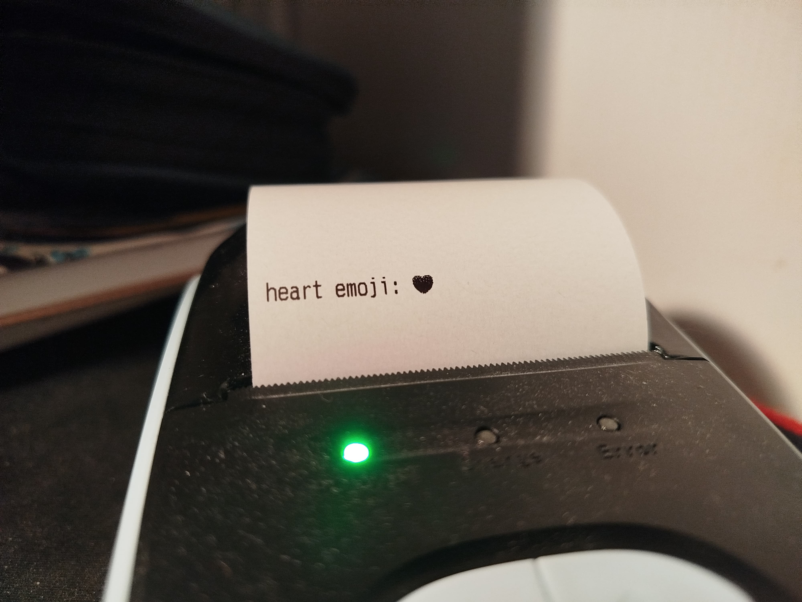

# EPOSNext

EPOSNext (short for **E**SC**POS**.**N**ET **Ext**ended) is a personal collection
of additional utilities for the [ESCPOS.NET](https://github.com/lukevp/ESC-POS-.NET) library,
which provides custom image dithering, native USB & Bluetooth printers (without needing serial adapters/drivers),
and software-rendered barcodes for printers which do not support them (PDF417, Aztec, DataMatrix).

# Installation

Install the NuGet package from [here](https://www.nuget.org/packages/EPOSNext) or from the command line:

```
PM> Install-Package EPOSNext
```

# Usage

## USB Printer

ESCPOS.NET only supports USB printers over Serial-USB interfaces, which means that it has to be mapped to one of the
serial ports (i.e. COM1). This library allows for direct USB I/O
via [LibUsbDotNet](https://github.com/LibUsbDotNet/LibUsbDotNet):

```csharp
// default options
var options = new UsbPrinterOptions() {
    // by default, ESCPOS.NET pushes all pending data into a queue,
    // which is then dequeued and sent asynchronously. setting Immediate to true
    // will force the data to be sent immediately (synchronously)
    Immediate = false,
    // how long to wait for the printer to respond
    ReadTimeout = TimeSpan.FromSeconds(1),
    // how long to attempt to write to the printer
    // (set this to a larger value if you send large chunks of data at a time)
    WriteTimeout = TimeSpan.FromSeconds(1)
}

// initialize the printer using the device's serial number...
using var printer = UsbPrinter.FromSerial(serial: "SERIALNUM", options);
// ...or via its vendor ID (VID) and product ID (PID)...
using var printer = UsbPrinter.FromIds(vid: 0x6868, pid: 0x0200, options);

// print!
var e = new EPSON();
printer.Write(e.PrintLine("hello, world!"));
```

## Bluetooth Printer

Direct Bluetooth I/O is possible via [InTheHand.Net.Bluetooth](https://github.com/inthehand/32feet):

```csharp
// default options
var options = new BluetoothPrinterOptions() {
    // by default, ESCPOS.NET pushes all pending data into a queue,
    // which is then dequeued and sent asynchronously. setting Immediate to true
    // will force the data to be sent immediately (synchronously)
    Immediate = false,
    // discovering bluetooth devices takes a relatively long time. checking
    // the paired devices list first will speed up the process of connecting
    // to the printer (if paired beforehand)
    CheckPairedDevices = true,
    // if false, the user must manually call printer.Connect() for any methods
    // to work
    AutoConnect = true
}

// initialize the printer using the device's name...
using var printer = BluetoothPrinter.FromDeviceName("PRINTERNAME", pin: "0000", options);
// ...or using the device's address...
using var printer = BluetoothPrinter.FromDeviceAddress("DC:0D:51:7E:FE:A4", pin: "0000", options);

// print!
var e = new EPSON();
printer.Write(e.PrintLine("hello, world!"));
```

## Image Dithering

All images printed are first converted to grayscale and a binary dither is applied to them.
ESCPOS.NET uses the `Stucki` algorithm for its `PrintImage` method. With this package, it's possible to print images
using different
dithering algorithms
using `PrintImageDithered` (via [ImageSharp](https://github.com/SixLabors/ImageSharp)):

```csharp
using var printer = {...};
var e = new EPSON();

printer.Write(e.PrintImageDithered(
    // byte[] of image data
    image: File.ReadAllBytes("example.jpg"),
    // Stucki by default
    ditherMode: ImageDitherMode.Burkes, 
    // by default will not resize the image.
    // the actual maximum width depends on your printer
    maxWidth: int.MaxValue
));
```

Here are some comparisons of different dithering algorithms:


## Inline Images

The `PrintImageInline` method allows to print a small image **inline** with the text. Note that the image will be
resized to a
very small resolution (8 or 24 pixels tall), so this method should mainly be used for symbols not supported by the font,
i.e. emojis:

```csharp
using var printer = {...};
var e = new EPSON();

printer.Write(
    e.Print("heart emoji: "),
    e.PrintImageInline(
    // byte[] of image data (in this case heart twemoji)
    image: File.ReadAllBytes("heart.png"),
    // defines whether the picture will be 8px tall or 24px tall,
    // DefaultDensity is 8px, HighDensity is 24px
    dotDensity: InlineImageDotDensity.HighDensity,
    // Stucki by default
    ditherMode: ImageDitherMode.Burkes, 
));
```



## Localized Text

`PrintLocalized` and `PrintLineLocalized` are convenience methods that automatically switch the code page and convert
the input text into the required `Encoding`:

```csharp
using var printer = {...};
var e = new EPSON();

printer.Write(
    // note that the library has no idea which code page
    // was used before this command, so it will *not* reset
    // to the default code page automatically
    e.PrintLineLocalized(CodePage.PC866_CYRILLIC2, "привет, мир!")
);
```

Note that not every `CodePage` is supported, mostly because they aren't standard encodings and thus don't have an
`Encoding` representation:

- `CodePage.KATAKANA`
- `CodePage.HIRAGANA`
- `CodePage.ONE_PASS_KANJI`
- `CodePage.ONE_PASS_KANJI2`
- `CodePage.KU42_THAI`
- `CodePage.TIS11_THAI`
- `CodePage.TIS13_THAI`
- `CodePage.TIS14_THAI`
- `CodePage.TIS16_THAI`
- `CodePage.TIS17_THAI`
- `CodePage.TIS18_THAI`
- `CodePage.TCVN3_VIETNAMESE_L`
- `CodePage.TCVN3_VIETNAMESE_U`

## Software-Rendered Barcodes

Not every thermal printer supports official ESC/POS commands for printing PDF417, Aztec and other types of barcodes.
This library adds support for printing PDF417, Aztec and DataMatrix barcodes using `PrintSoftwarePdf417`,
`PrintSoftwareAztec` and `PrintSoftwareDataMatrix` methods respectively (backed
by [Zxing.Net](https://github.com/micjahn/ZXing.Net)):

```csharp
using var printer = {...};
var e = new EPSON();

printer.Write(
    e.CenterAlign(),
    e.PrintLine("PDF417"),
    e.PrintSoftwarePdf417(
        contents: "meow", 
        // the actual maximum width depends on your printer
        maxWidth: 380, 
        // if true, the right row indicator 
        // and the stop pattern will be omitted
        compact: false,
        // ratio between rows and columns
        aspectRatio: Pdf417AspectRatio.A2
    ),
    e.PrintLine(""),
    e.PrintLine("Aztec"),
    e.PrintSoftwareAztec(
        contents: "meow",
        size: 80
    ),
    e.PrintLine(""),
    e.PrintLine("DataMatrix"),
    e.PrintSoftwareDataMatrix(
        contents: "meow",
        size: 80
    ),
    e.PrintLine("")
);
```


## Other

### `SelectCharacterFont`

Changes the font used for printing.

### `ReverseColorsMode`

Inverts the colors; instead of black text on a white background will print white text on a black background.

### `SkipLines`

A shorthand for repeating `e.PrintLine("")` the required amount of times.

```csharp
using var printer = {...};
var e = new EPSON();

void TestFonts()
{
    foreach (var font in Enum.GetValues<CharacterFontType>())
    {
        printer.Write(
            e.SelectCharacterFont(font),
            e.PrintLine($"Lorem ipsum dolor sit ({font})")
        );
    }
}

TestFonts();
printer.Write(e.SkipLines(3), e.ReverseColorsMode(true));
TestFonts();
printer.Write(e.SkipLines(3));
```

